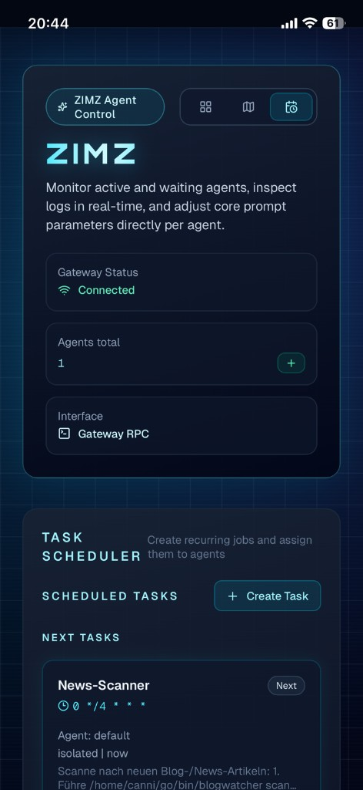

<p align="center">
  
</p>

<h1 align="center">Z I M Z</h1>

<p align="center">
  <strong>Multi-Agent Dashboard for <a href="https://github.com/openclaw/openclaw">OpenClaw</a></strong><br/>
  <em>Alternative UI with focus on clarity, real-time monitoring, and full Gateway RPC integration.</em>
</p>

<p align="center">
  
  
  
  
  
</p>

---

## What is ZIMZ?

ZIMZ is a self-hosted dashboard for managing and monitoring [OpenClaw](https://github.com/openclaw/openclaw) agents. It connects directly to the OpenClaw Gateway via WebSocket RPC — no CLI wrapping, no polling, just a persistent real-time connection.

Built for operators who run OpenClaw on a VPS or homelab and want a clean overview of their agents without SSHing into a terminal.

## Screenshots

<p align="center">
  
  &nbsp;
  
</p>

<p align="center">
  
</p>

<p align="center">
  <sub>Left: Agent Grid with detail bubble &nbsp;·&nbsp; Right: Office Map with status zones &nbsp;·&nbsp; Bottom: Mobile via iOS home button</sub>
</p>

## Features

**Agent Management** — Add, inspect, configure, and delete agents directly from the dashboard. Each action maps to a Gateway RPC call (`agents.add`, `agents.list`, `agents.update`, `agents.delete`).

**Live Status** — Persistent WebSocket connection to the Gateway streams events (`agent`, `heartbeat`, `chat`, `presence`) via Server-Sent Events to the browser. Agent cards update in real-time without refresh.

**Three Views** — Switch between Agent Grid (card layout with detail bubbles), Office Map (agents grouped by status zones: Dev Lab, Meeting Room, Lounge), and Task Scheduler (cron jobs with create/edit/run/delete).

**Agent Bubble** — Click any agent card to open a detail overlay with two tabs: Info (current task, live log stream) and Settings (SOUL.md and MEMORY.md editor, danger zone for deletion).

**Model Assignment** — Assign or change the AI model for each agent via the dashboard. Models are fetched from the Gateway's configured provider list.

**Task Scheduler** — Create and manage cron jobs assigned to specific agents. Supports cron expressions, interval schedules, one-shot timers, and delivery options.

**Gateway Health** — Header shows live connection status (connected/disconnected) and agent count. Status endpoint exposes `health` and `system-presence` data.

**Mobile Ready** — Responsive layout, works as iOS/Android home screen shortcut.

## Tech Stack

| Layer | Technology |
|-------|-----------|
| Framework | Next.js 16 (App Router, SSR) |
| Frontend | React 19, TypeScript 5 |
| Styling | Tailwind CSS v4 (dark mode, terminal aesthetic) |
| Animation | Framer Motion |
| Icons | Lucide React |
| Gateway | WebSocket RPC via `ws` (server-side) |
| Live Events | SSE (Server-Sent Events → browser) |

## Quickstart

```bash
git clone https://github.com/burnshall-ui/ZimZ
cd ZimZ
npm install
npm run dev
```

Open [http://localhost:3000](http://localhost:3000). The dashboard connects to `ws://127.0.0.1:18789` by default.

## Environment

Create `.env.local` (local dev) or `.env` (VPS):

```bash
OPENCLAW_GATEWAY_URL=ws://127.0.0.1:18789

# If your Gateway requires auth:
OPENCLAW_GATEWAY_TOKEN=
OPENCLAW_GATEWAY_PASSWORD=
```

## Gateway RPC Integration

All communication with OpenClaw runs through the Gateway WebSocket — no CLI exec, no file reads, no shell commands. The server-side RPC client handles the full protocol handshake (`connect.challenge` → `connect` → RPC call → response).

### API Routes → RPC Methods

| Route | Method | Gateway RPC |
|-------|--------|-------------|
| `GET /api/agents` | List agents | `agents.list` |
| `POST /api/agents` | Add agent | `agents.add` |
| `PATCH /api/agents/:id` | Update agent/model | `agents.update` |
| `DELETE /api/agents/:id` | Delete agent | `agents.delete` |
| `GET /api/models` | Available models | `models.list` |
| `GET /api/status` | Health + presence | `health` / `system-presence` |
| `GET /api/events` | SSE event stream | persistent WS subscription |
| `GET /api/cron/jobs` | List cron jobs | `cron.list` |
| `POST /api/cron/jobs` | Create cron job | `cron.add` |
| `PATCH /api/cron/jobs/:id` | Update cron job | `cron.update` |
| `DELETE /api/cron/jobs/:id` | Delete cron job | `cron.remove` |
| `POST /api/cron/jobs/:id/run` | Run cron job now | `cron.run` |

The browser never talks to the Gateway directly — all RPC flows through Next.js server-side API routes.

## Deploy on Linux VPS

```bash
npm ci
npm run build
npm run start
```

Recommended setup:

```
  Browser ──HTTPS──▸ Nginx/Caddy ──HTTP──▸ next start (:3000)
                                                │
                                          WebSocket RPC
                                                │
                                     OpenClaw Gateway (:18789)
```

Run `next start` behind `systemd` or `pm2`, reverse-proxy via Nginx or Caddy inside your Tailnet, keep the Gateway on `127.0.0.1:18789`. Step-by-step instructions in [`DEPLOY.md`](./DEPLOY.md).

## Project Structure

```
app/
  layout.tsx              # Root layout (dark theme, Orbitron font)
  page.tsx                # SSR entry — direct Gateway RPC for agent list
  globals.css             # Tailwind + cyberpunk CSS
  api/
    agents/route.ts       # agents.list / agents.add (Gateway RPC)
    agents/[id]/route.ts  # agents.delete / agents.update (Gateway RPC)
    models/route.ts       # models.list (Gateway RPC)
    status/route.ts       # health + system-presence (Gateway RPC)
    events/route.ts       # SSE stream — persistent Gateway WS events
    cron/jobs/…           # cron.list / cron.add / cron.update / cron.remove

src/
  lib/
    openclawGateway.ts    # WS RPC client + GatewayEventManager singleton
  hooks/
    useGatewayEvents.ts   # React hook — SSE consumer, live agent status
  components/
    DashboardView.tsx     # Main layout with header, views, live events
    AgentGrid.tsx         # Card grid layout
    AgentCard.tsx         # Individual agent card
    AgentBubble.tsx       # Detail popup (Info + Settings tabs)
    OfficeMap.tsx         # Status zone map (Dev Lab / Meeting Room / Lounge)
    AddAgentModal.tsx     # Agent registration modal
    TasksView.tsx         # Cron job scheduler
    ConfirmDialog.tsx     # Reusable confirmation dialog
  types/
    agent.ts              # Agent types (OpenClaw-compatible)
    cron.ts               # Cron types (OpenClaw-compatible)
  data/
    mockData.ts           # Fallback agents (when Gateway is offline)
```

## OpenClaw Docs

- [Gateway Protocol](https://docs.openclaw.ai/gateway/protocol) — WebSocket framing, handshake, auth
- [Multi-Agent Routing](https://docs.openclaw.ai/concepts/multi-agent) — Agent isolation, bindings, workspaces
- [Gateway Architecture](https://docs.openclaw.ai/concepts/architecture) — How the Gateway daemon works
- [Configuration Reference](https://docs.openclaw.ai/gateway/configuration-reference) — `openclaw.json` schema

## License

MIT
