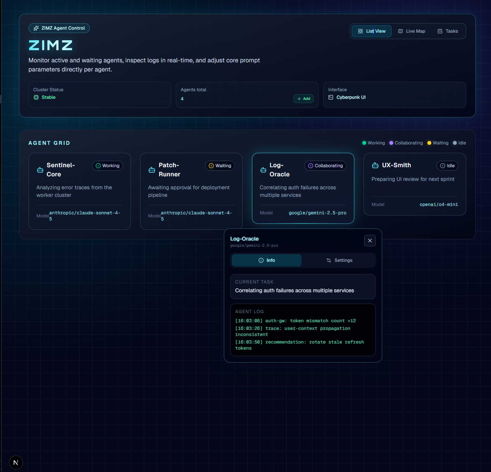
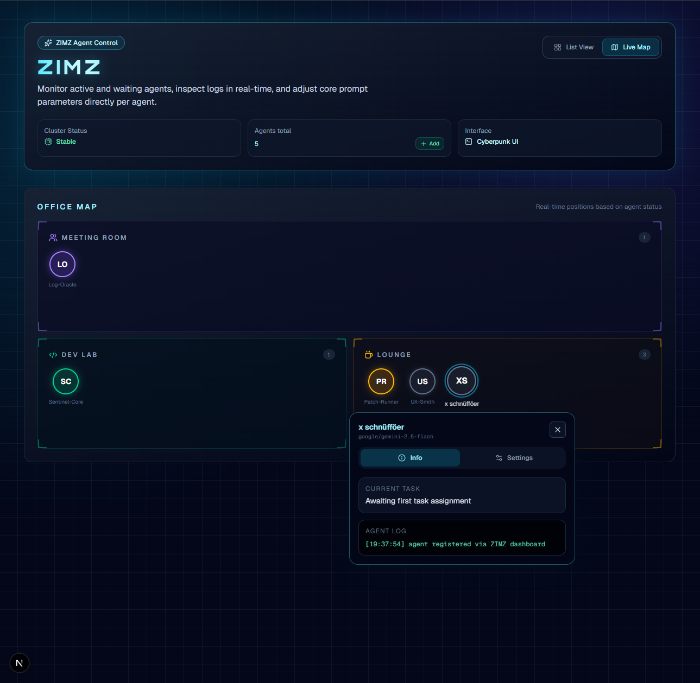

# ZIMZ – Multi-Agent Dashboard for OpenClaw

Cyberpunk-style dashboard for monitoring and controlling OpenClaw agents.

## Tech Stack

- **Next.js 16** (App Router)
- **React 19** + **TypeScript**
- **Tailwind CSS v4** (Dark Mode, Terminal aesthetic)
- **Framer Motion** (Animations)
- **Lucide React** (Icons)

## OpenClaw Integration

ZIMZ connects to the **OpenClaw Gateway** via WebSocket (Port 18789):
- Protocol docs: https://docs.openclaw.ai/gateway/protocol
- Architecture: https://docs.openclaw.ai/concepts/architecture
- Multi-Agent: https://docs.openclaw.ai/concepts/multi-agent

### Features

- Agent Grid + Office Map view with live status
- Agent Bubble: Info (task, logs) + Settings (SOUL.md, MEMORY.md)
- Add / Delete agents (mirrors `openclaw agents add` / `openclaw agents delete`)
- Cluster status and health monitoring
- Presence display (connected clients/nodes)

## UI Preview

<p align="center">
  
  
</p>

## Quickstart

```bash
npm install
npm run dev
```

Then open http://localhost:3000

## Environment (VPS / Tailnet)

Create a `.env.local` for local dev and a `.env` on your VPS deployment:

```bash
OPENCLAW_GATEWAY_URL=ws://127.0.0.1:18789
# Optional when your gateway requires auth:
OPENCLAW_GATEWAY_TOKEN=
```

The app now exposes server-side API routes that proxy cron operations to OpenClaw:

- `GET /api/cron/jobs` -> `cron.list`
- `POST /api/cron/jobs` -> `cron.add`
- `PATCH /api/cron/jobs/:jobId` -> `cron.update`
- `DELETE /api/cron/jobs/:jobId` -> `cron.remove`
- `POST /api/cron/jobs/:jobId/run` -> `cron.run`

Because this runs server-side, the browser does not need direct access to the gateway port.

## Deploy on Linux VPS

```bash
npm ci
npm run build
npm run start
```

Detailed step-by-step deploy instructions: `DEPLOY.md`.

Recommended:

- run `next start` behind `systemd` or `pm2`
- bind gateway and app to internal interfaces (localhost/Tailscale only)
- reverse-proxy via Nginx/Caddy inside your Tailnet
- keep `OPENCLAW_GATEWAY_URL` internal (`127.0.0.1:18789`)

## Project Structure

```
app/
  layout.tsx          # Root layout (dark theme, Orbitron font)
  page.tsx            # Entry point -> DashboardView
  globals.css         # Tailwind + Cyberpunk CSS

src/
  lib/
    openclawGateway.ts # Server-side WS RPC client for OpenClaw Gateway
  components/
    DashboardView.tsx # Main dashboard with header + view toggle
    AgentGrid.tsx     # Grid layout of agent cards
    AgentCard.tsx     # Individual agent card
    AgentBubble.tsx   # Detail popup (Info + Settings tabs)
    OfficeMap.tsx     # Alternative map view with zones
    AddAgentModal.tsx # Modal for registering new agents
    ConfirmDialog.tsx # Reusable confirmation dialog
  data/
    mockData.ts       # Mock agents (fallback without Gateway)
  types/
    agent.ts          # Agent types (OpenClaw-compatible)
    cron.ts           # Cron payload/update types (OpenClaw-compatible)
```
